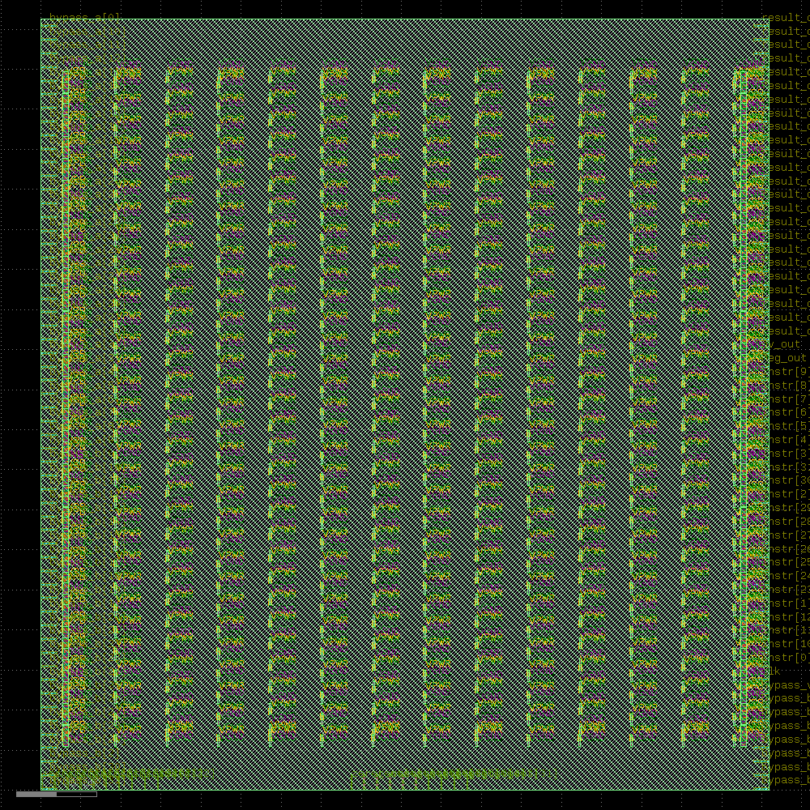
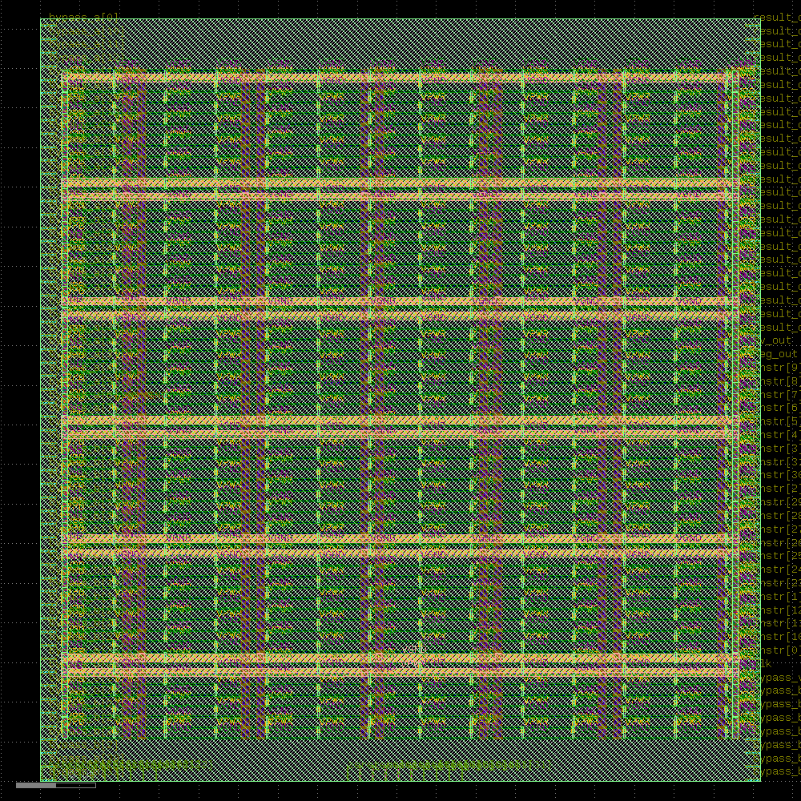
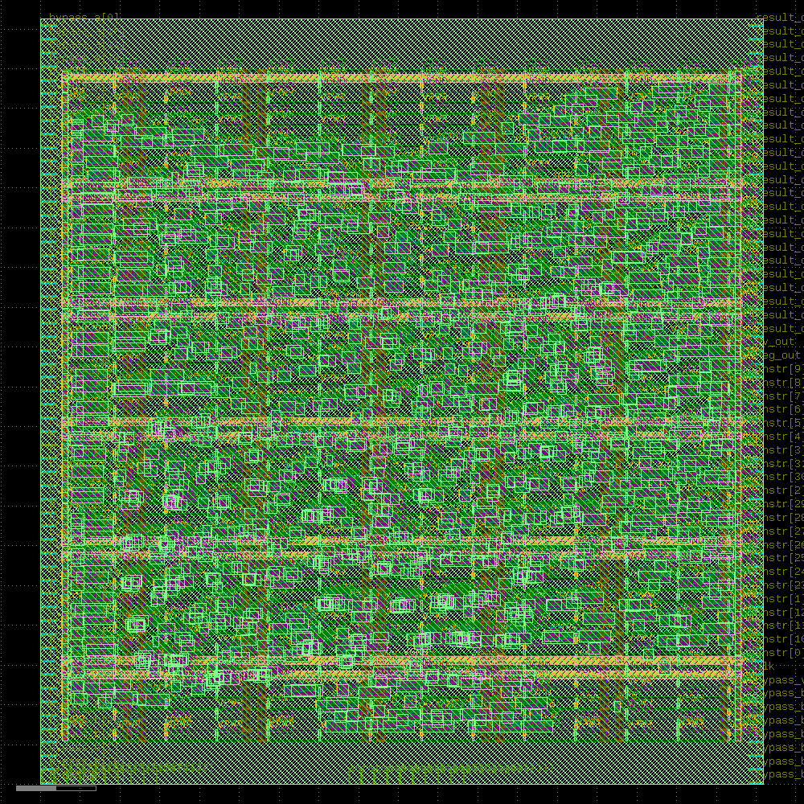
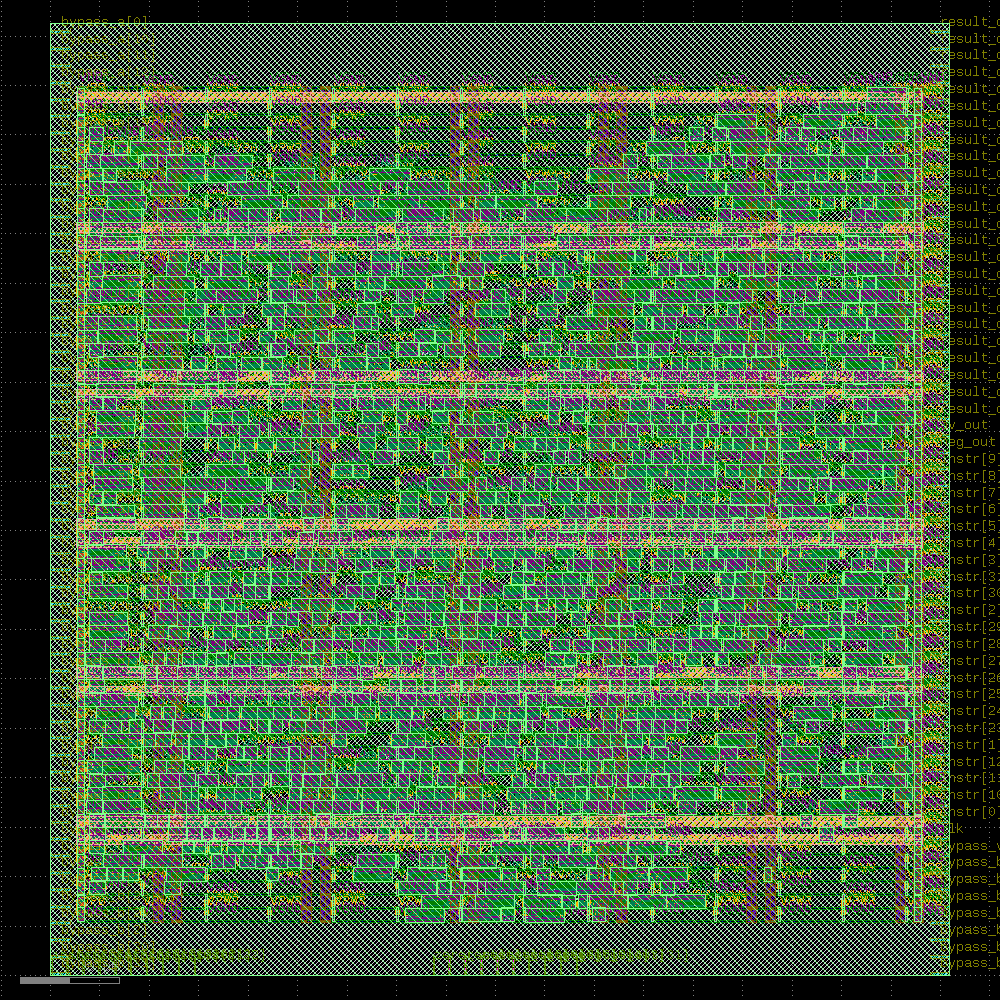
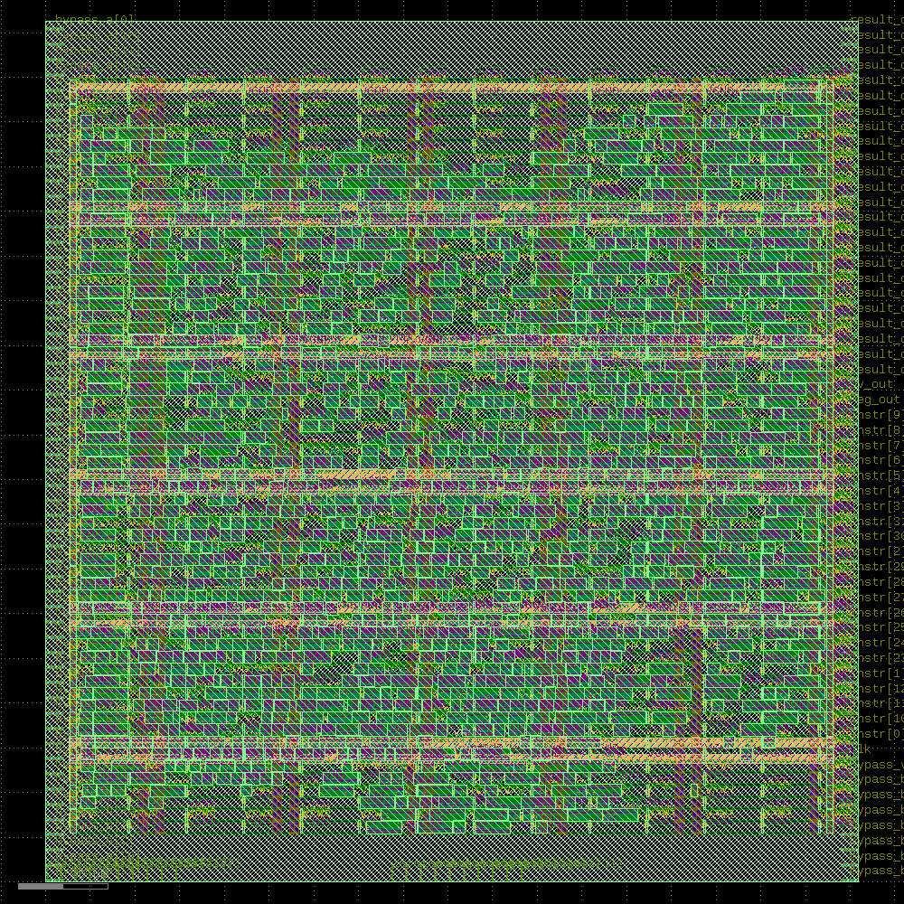
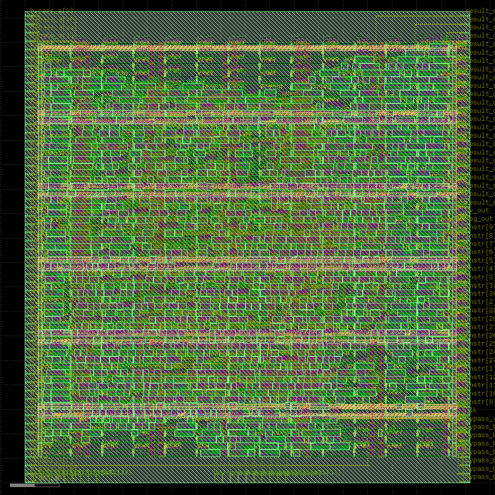
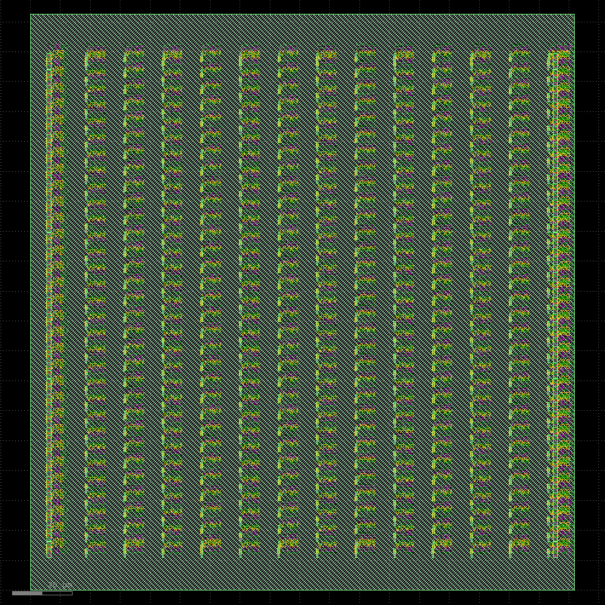
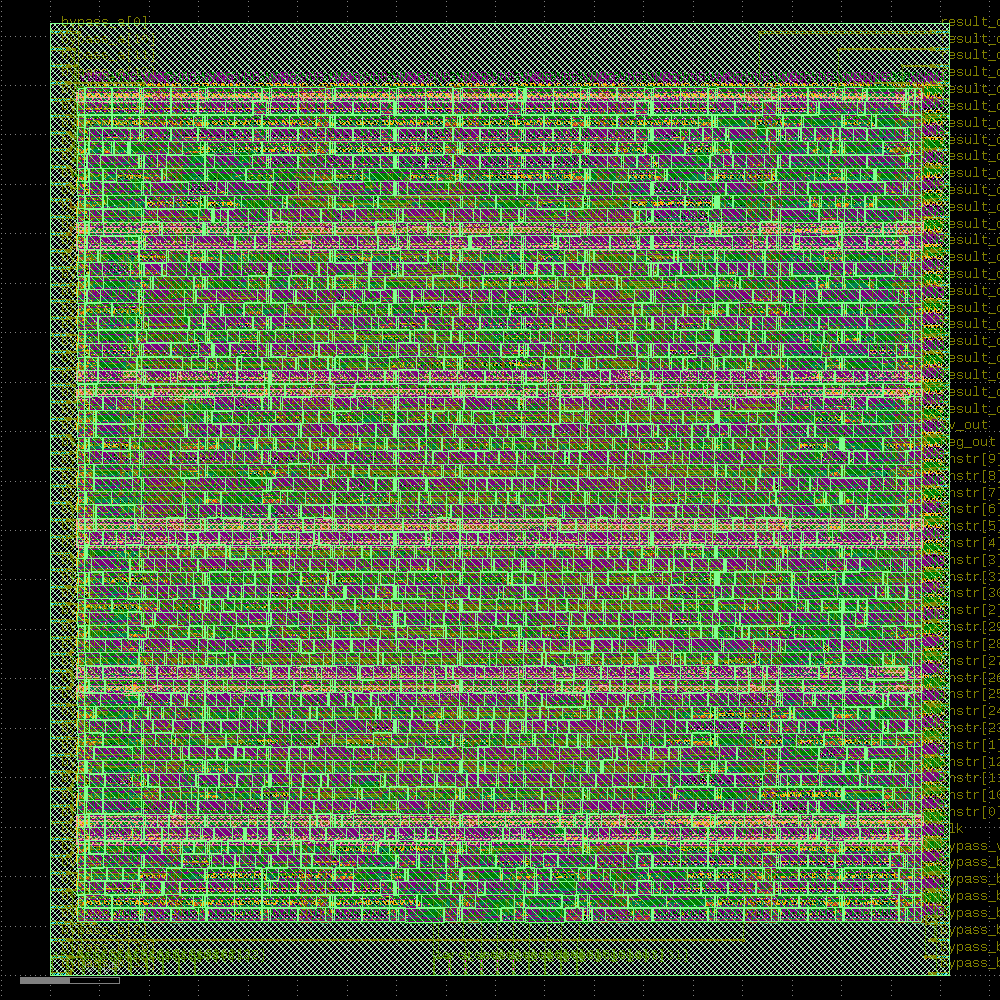
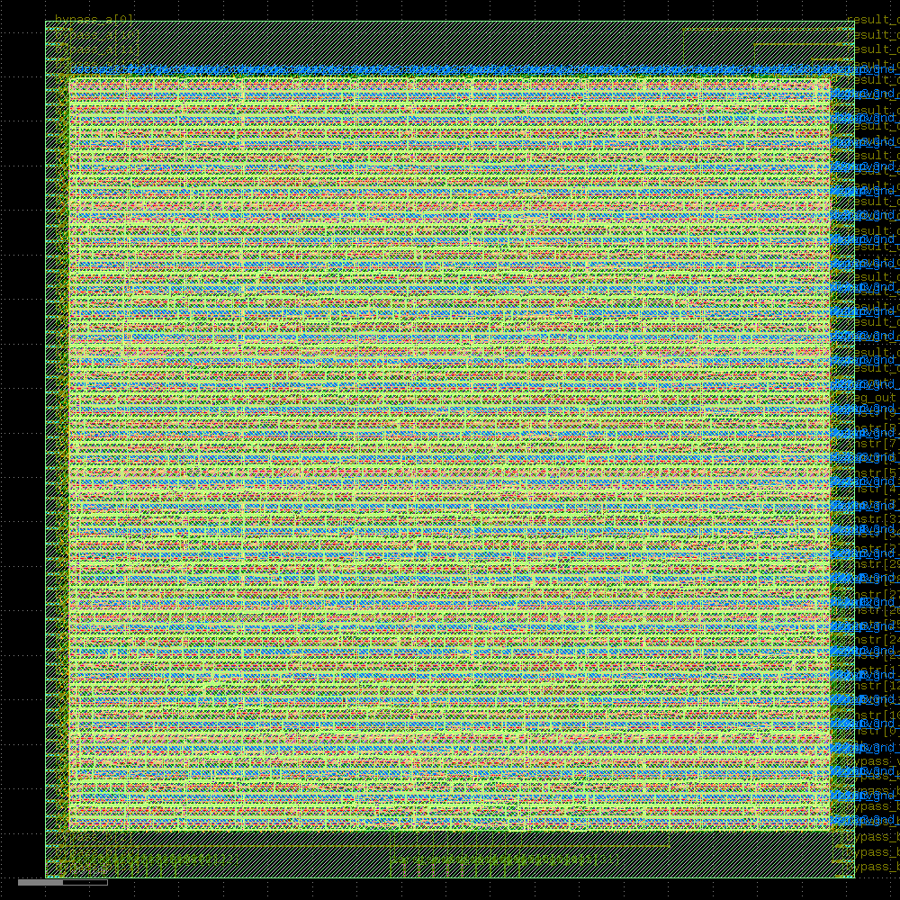

<div align="center">

# ⚡ 5-Stage Pipelined 32-bit ALU — RTL to GDS

**A fully pipelined, silicon-ready 32-bit ALU implemented through the complete RTL-to-GDS flow using 100% open-source EDA tools on the SkyWater sky130A 130nm PDK.**

[Architecture](#architecture) · [Flow](#rtl-to-gds-flow) · [Results](#results) · [Usage](#usage) · [Repo Structure](#repository-structure)

</div>

---

## Overview

This project implements a **5-stage pipelined 32-bit ALU** (`spm`) and takes it all the way from Verilog RTL to a verified GDSII layout using the **LibreLane** open-source RTL-to-GDS framework targeting the **SkyWater sky130A 130nm** process.

| Parameter | Value |
|-----------|-------|
| **Top module** | `spm` |
| **Architecture** | 5-stage pipeline (IF → ID → EX → MA → WB) |
| **Datapath width** | 32-bit |
| **ALU operations** | 12 (ADD, SUB, AND, OR, XOR, NOR, SLT, SLTU, SLL, SRL, SRA, PASS) |
| **Adder** | Carry-Lookahead (CLA) — 8 × 4-bit blocks |
| **Shifter** | Log2 barrel shifter — 5 shift stages (SLL / SRL / SRA) |
| **Pipeline latency** | 4 clock cycles |
| **Throughput** | 1 result / cycle (steady state) |
| **Target clock** | 10 ns (100 MHz) |
| **PDK** | SkyWater sky130A |
| **Standard cell lib** | `sky130_fd_sc_hd` (high-density) |
| **Reset style** | Synchronous active-high |
| **EDA flow** | LibreLane (Yosys + OpenROAD + KLayout + Magic + Netgen) |

---

## Architecture

### Module Hierarchy

```
spm  (top)
├── alu_core              ← combinational ALU, one-hot result mux
│   ├── cla32 [×2]        ← 32-bit carry-lookahead adder (ADD + SUB)
│   │   └── cla4 [×8]     ← 4-bit CLA building block
│   └── barrel_shifter [×3] ← log2 barrel shifter (SLL / SRL / SRA)
```

### Pipeline Stages

<div align="center">
  
</div>

```
┌──────────┐    ┌──────────┐    ┌──────────┐    ┌──────────┐    ┌──────────┐
│ Stage 1  │    │ Stage 2  │    │ Stage 3  │    │ Stage 4  │    │ Stage 5  │
│  IF/ID   │───▶│  ID/EX   │───▶│  EX/MA   │───▶│  MA/WB   │───▶│  WB out  │
│          │    │          │    │          │    │          │    │          │
│ ifid_    │    │ idex_a/b │    │ exma_    │    │ mawb_    │    │ wb_      │
│ instr    │    │ idex_op  │    │ result   │    │ result   │    │ result   │
└──────────┘    └──────────┘    └──────────┘    └──────────┘    └──────────┘
  Latch instr    Decode op,       ALU executes,   Memory stage    Writeback:
                 sign-extend,     latch result    (pass-through)  result_out
                 apply bypass     + flags                         + flags out
```

### Port Interface

| Port | Dir | Width | Description |
|------|-----|-------|-------------|
| `clk` | in | 1 | Rising-edge clock |
| `rst` | in | 1 | Synchronous active-high reset |
| `instr` | in | 32 | [31:28]=op, [27:23]=rs1, [22:18]=rs2, [17:13]=rd, [12:0]=imm13 |
| `bypass_a` | in | 32 | Forwarded operand A |
| `bypass_b` | in | 32 | Forwarded operand B / immediate |
| `bypass_valid` | in | 1 | Assert to override decoded rs1/rs2 with bypass inputs |
| `result_out` | out | 32 | ALU result (4-cycle latency) |
| `zero_out` | out | 1 | High when result_out == 0 |
| `neg_out` | out | 1 | MSB of result_out (sign bit) |
| `ov_out` | out | 1 | Signed overflow (ADD / SUB) |

### ALU Operation Encoding

| op[3:0] | Mnemonic | Operation |
|---------|----------|-----------|
| `4'b0000` | ADD | `a + b` |
| `4'b0001` | SUB | `a - b` |
| `4'b0010` | AND | `a & b` |
| `4'b0011` | OR | `a | b` |
| `4'b0100` | XOR | `a ^ b` |
| `4'b0101` | SLT | `(a < b signed) ? 1 : 0` |
| `4'b0110` | SLTU | `(a < b unsigned) ? 1 : 0` |
| `4'b0111` | SLL | `a << b[4:0]` |
| `4'b1000` | SRL | `a >> b[4:0]` (zero fill) |
| `4'b1001` | SRA | `a >>> b[4:0]` (sign fill) |
| `4'b1010` | NOR | `~(a | b)` |
| `4'b1011` | PASS | `b` (move / load-immediate) |

---

## RTL-to-GDS Flow

The complete implementation was run on **Google Colab** using the **LibreLane** notebook.

```
RTL (spm.v)
    │
    ▼
[1]  Yosys Synthesis       → Technology netlist (.nl.v) mapped to sky130_fd_sc_hd
    │
    ▼
[2]  OpenROAD Floorplan    → Die area, core utilization, placement grid
    │
    ▼
[3]  Tap/Endcap Insertion  → nwell/psubstrate connectivity, latch-up prevention
    │
    ▼
[4]  I/O Placement         → Metal pins for all top-level ports on die boundary
    │
    ▼
[5]  PDN Generation        → VDD/VSS power grid (2 µm stripes, 30 µm pitch)
    │
    ▼
[6]  Global Placement      → Wirelength-optimal fuzzy cell placement
    │
    ▼
[7]  Detailed Placement    → Grid-legal placement  |  1791 filler instances placed
    │
    ▼
[8]  Clock Tree Synthesis  → 17 clock buffers + 15 clock inverters inserted
    │
    ▼
[9]  Global Routing        → 1405 nets routed  |  75,037 µm total wirelength
    │
    ▼
[10] Detailed Routing      → Physical metal polygons + vias  (li1 → met5)
    │
    ▼
[11] Fill Insertion         → 1915 fill cells + 416 tap cells  |  3662 total cells
    │
    ▼
[12] RCX (Parasitics)      → SPEF files per PVT corner
    │
    ▼
[13] STA Post-PnR          → Verified across 9 PVT corners with SPEF parasitics
    │
    ▼
[14] KLayout Stream-out    → GDSII (.gds)
    │
    ▼
[15] Magic DRC             → ✅ 0 violations
    │
    ▼
[16] Magic SPICE Extract   → Netlist from layout for LVS
    │
    ▼
[17] Netgen LVS            → ✅ 0 violations
    │
    ▼
 GDSII ✅  Silicon-ready
```

### Physical Design Stages

#### I/O Placement
<div align="center">
  
  <p><em>Metal pins placed on die boundary for all top-level ports</em></p>
</div>

#### Power Distribution Network (PDN)
<div align="center">
  
  <p><em>VDD/VSS power grid with 2 µm stripes at 30 µm pitch</em></p>
</div>

#### Global Placement
<div align="center">
  
  <p><em>Wirelength-optimal fuzzy cell placement</em></p>
</div>

#### Detailed Placement
<div align="center">
  
  <p><em>Grid-legal placement with 1791 filler instances</em></p>
</div>

#### Clock Tree Synthesis
<div align="center">
  
  <p><em>17 clock buffers + 15 clock inverters inserted for balanced clock distribution</em></p>
</div>

#### Detailed Routing
<div align="center">
  
  <p><em>1405 nets routed with 75,037 µm total wirelength across li1 → met5</em></p>
</div>

#### Tap/Decap/Fill Insertion
<div align="center">
  
  <p><em>Tap cells for substrate connectivity</em></p>
</div>

<div align="center">
  
  <p><em>1915 fill cells + 416 tap cells inserted (3662 total cells)</em></p>
</div>

#### Final GDSII Layout
<div align="center">
  
  <p><em>Silicon-ready GDSII layout — DRC clean, LVS clean</em></p>
</div>

---

## Results

### Cell Count (Post-Routing, Pre-Fill)

| Cell Type | Count | Area (µm²) |
|-----------|-------|------------|
| Multi-Input combinational cell | 1082 | 10414.99 |
| Sequential cell | 192 | 4083.92 |
| Clock buffer | 17 | 245.24 |
| Clock inverter | 15 | 185.18 |
| Inverter | 24 | 90.09 |
| Buffer | 1 | 5.00 |
| Tap cell | 416 | 520.50 |
| Fill cell | 124 | 465.45 |
| **Total** | **1871** | **16010.36** |

### Cell Count (Post-Fill — Final)

| Cell Type | Count | Area (µm²) |
|-----------|-------|------------|
| Fill cell | 1915 | 13235.19 |
| Tap cell | 416 | 520.50 |
| All functional cells | 1331 | 15024.41 |
| **Grand Total** | **3662** | **28780.10** |

### Routing Resources

| Layer | Direction | Original | Derated | Reduction |
|-------|-----------|----------|---------|-----------|
| li1 | Vertical | 0 | 0 | 0.00% |
| met1 | Horizontal | 14488 | 6950 | 52.03% |
| met2 | Vertical | 10680 | 6805 | 36.28% |
| met3 | Horizontal | 7244 | 4743 | 34.53% |
| met4 | Vertical | 4326 | 2082 | 51.87% |
| met5 | Horizontal | 1428 | 600 | 57.98% |

**Total routed nets:** 1,405  
**Total wirelength:** 75,037 µm

### Static Timing Analysis — Post-PnR

All results from **OpenROAD STAPostPNR** with extracted SPEF parasitics.

| Corner | Hold Worst Slack | Hold Vio | Setup Worst Slack | Setup TNS | Setup Vio | Overall |
|--------|------------------|----------|-------------------|-----------|-----------|---------|
| **nom_tt_025C_1v80** | 0.2028 | 0 | +3.3628 | 0.0000 | 0 | ✅ |
| **nom_ss_100C_1v60** | 0.6998 | 0 | -3.1204 | -22.120 | 17 | ⚠️ |
| **nom_ff_n40C_1v95** | 0.0320 | 0 | +5.7190 | 0.0000 | 0 | ✅ |
| **min_tt_025C_1v80** | 0.2026 | 0 | +3.4315 | 0.0000 | 0 | ✅ |
| **min_ss_100C_1v60** | 0.6990 | 0 | -3.0522 | -39.071 | 16 | ⚠️ |
| **min_ff_n40C_1v95** | 0.0319 | 0 | +5.7591 | 0.0000 | 0 | ✅ |
| **max_tt_025C_1v80** | 0.2038 | 0 | +3.3172 | 0.0000 | 0 | ✅ |
| **max_ss_100C_1v60** | 0.7017 | 0 | -3.3049 | -44.055 | 18 | ⚠️ |
| **max_ff_n40C_1v95** | 0.0322 | 0 | +5.7068 | 0.0000 | 0 | ✅ |
| **Overall** | **0.0319** | **0 ✅** | **-3.3049** | **-44.055** | **51** | |

**Hold timing:** CLEAN — 0 violations across all 9 corners.

**Setup timing:** Passes with large positive slack at all TT and FF corners (3.3–5.7 ns margin). Violations only at SS corners (slow-slow process, 100°C, 1.6V) — the most pessimistic corner on sky130A.

**Fix:** set `CLOCK_PERIOD=12` for full SS-corner closure.

### Timing Analysis Screenshots

<details>
<summary>Click to view detailed timing analysis reports</summary>

<div align="center">
  
  <p><em>Timing report - Setup/Hold analysis</em></p>
  <br><br>
  
  
  <p><em>Multi-corner timing summary</em></p>
  <br><br>
  
  
  <p><em>Critical path analysis</em></p>
  <br><br>
  
  
  <p><em>PVT corner analysis results</em></p>
  <br><br>
  
  
  <p><em>Slack distribution and timing paths</em></p>
  <br><br>
  
  
  <p><em>Setup timing violations detail</em></p>
  <br><br>
  
  
  <p><em>Hold timing verification</em></p>
  <br><br>
  
  
  <p><em>Final timing closure summary</em></p>
</div>

</details>

### Physical Design

| Metric | Value |
|--------|-------|
| **Process** | sky130A — 130 nm |
| **Standard cell library** | `sky130_fd_sc_hd` |
| **Filler instances placed** | 1791 |
| **PDN stripe width** | 2 µm (V and H) |
| **PDN stripe pitch** | 30 µm (V and H) |
| **Metal stack** | li1 + met1–met5 |
| **DRC violations** | 0 ✅ |
| **LVS violations** | 0 ✅ |

### Implementation Screenshots

<details>
<summary>Click to view detailed implementation screenshots</summary>

<div align="center">
  
  <br><br>
  
  <br><br>
  
  <br><br>
  
  <br><br>
  
  <br><br>
  
  <br><br>
  
  <br><br>
  
</div>

</details>

---

## Usage

### Run on Google Colab

Open `colab/RTL_TO_GDS_CLOUD.ipynb` in Google Colab and run all cells in order.

The notebook:
- Installs Nix + LibreLane automatically
- Writes `spm.v` from the `%%writefile` cell
- Runs all 17 implementation steps interactively
- Streams progress and displays layout previews at each step

### Simulate locally (Icarus Verilog)

```bash
# Compile
iverilog -o sim rtl/spm.v rtl/tb_spm.v

# Run
vvp sim

# View waveforms
gtkwave dump.vcd
```

### Quick functional check — single ADD

```verilog
// op=ADD(0000), a=5, b=3 via bypass
instr        = {4'b0000, 28'b0};
bypass_a     = 32'd5;
bypass_b     = 32'd3;
bypass_valid = 1;

// result_out = 32'd8  after 4 clock cycles
```

---

## Design Notes

### Why synchronous reset?

The `sky130_fd_sc_hd` library maps synchronous-reset flip-flops to `DFRTP` cells natively. Using `always @(posedge clk or posedge rst)` (async reset) caused Yosys `PROC_DFF` to throw:

```
ERROR: Multiple edge sensitive events found for this signal!
```

**Fix:** All pipeline registers use `always @(posedge clk)` with `rst` as a synchronous condition inside the block.

### Why one-hot assign mux in alu_core?

The original `always @(*)` `case(op)` in `alu_core` conflicted with the pipeline DFF elaboration during Yosys hierarchy flattening.

**Fix:** Replaced with pure `assign` one-hot masking:

```verilog
wire [31:0] mux_add  = {32{op == `ALU_ADD}}  & add_r;
wire [31:0] mux_sub  = {32{op == `ALU_SUB}}  & sub_r;
// ...
assign result = mux_add | mux_sub | mux_and | ...;
```

Zero processes — zero `PROC_DFF` conflicts. Maps cleanly to AND-OR trees on sky130.

### Setup violations at SS corner

The `_ss_100C_1v60` corners show setup violations. This is the most pessimistic PVT combination on sky130A (slow process, 100°C junction temp, 1.6V supply — 11% below nominal). All TT and FF corners pass with 3.3–5.7 ns of positive slack.

**To resolve:**

```python
# In Config.interactive() — relax clock period for full SS closure
Config.interactive("spm", PDK="sky130A", CLOCK_PERIOD=12, ...)
```

---

## Repository Structure

```
EVOLVE-3X-5stage-alu-rtl-gds/
├── README.md
├── rtl/
│   └── spm.v                        # Complete synthesizable Verilog
├── colab/
│   └── RTL_TO_GDS_CLOUD.ipynb       # LibreLane Google Colab notebook
├── reports/
│   └── EVOLVE3X_5Stage_ALU_RTL_to_GDS_Report.docx
├── results/
│   ├── synthesis/                   # Yosys netlist (.nl.v)
│   ├── floorplan/                   # DEF after floorplan
│   ├── routing/                     # Final routed DEF
│   ├── gds/                         # Final GDSII (.gds)
│   ├── spef/                        # Parasitic extraction (.spef)
│   ├── timing/                      # STA reports (.rpt, .sdf, .lib)
│   └── drc_lvs/                     # Magic DRC + Netgen LVS logs
└── docs/
    └── architecture.md
```

---

## Tools & References

| Tool | Version | Purpose |
|------|---------|---------|
| **LibreLane** | latest | RTL-to-GDS orchestration |
| **Yosys** | 0.46 | Synthesis |
| **OpenROAD** | latest | P&R, CTS, STA |
| **KLayout** | latest | GDSII stream-out |
| **Magic** | latest | DRC + SPICE extraction |
| **Netgen** | latest | LVS |
| **sky130A PDK** | latest | SkyWater 130nm process |

---

## Future Work

- [ ] Set `CLOCK_PERIOD=12` for full SS-corner timing closure
- [ ] Register file (32×32) integration → full execution unit
- [ ] Branch comparator unit (BEQ, BNE, BLT, BGE)
- [ ] Load/store memory interface in Stage 4
- [ ] Automatic hazard detection unit asserting `bypass_valid`
- [ ] RISC-V RV32I decoder → complete integer pipeline
- [ ] Formal verification with SymbiYosys
- [ ] Efabless chipIgnite MPW submission

---

## License

MIT License — see LICENSE for details.

---

<div align="center">

**EVOLVE.3X — Open Hardware. Open Silicon. Open Source.**

Built with [LibreLane](https://github.com/efabless/LibreLane) · [SkyWater sky130A](https://github.com/google/skywater-pdk) · [Google Colab](https://colab.research.google.com/)

</div>
